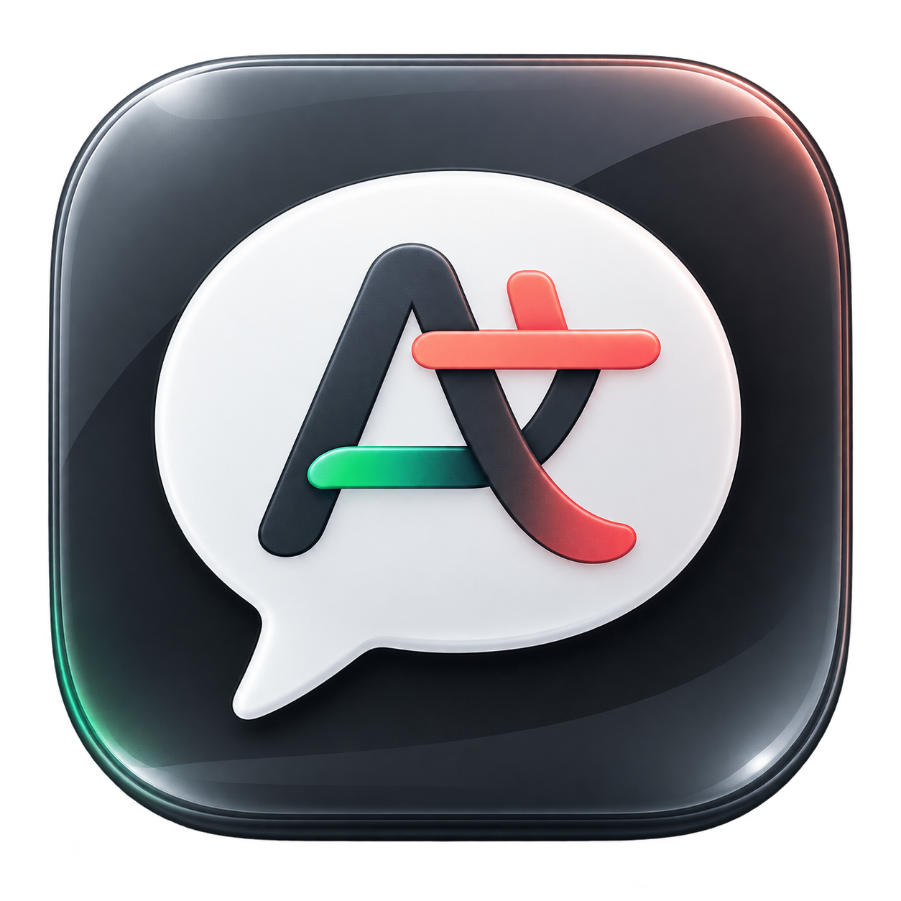
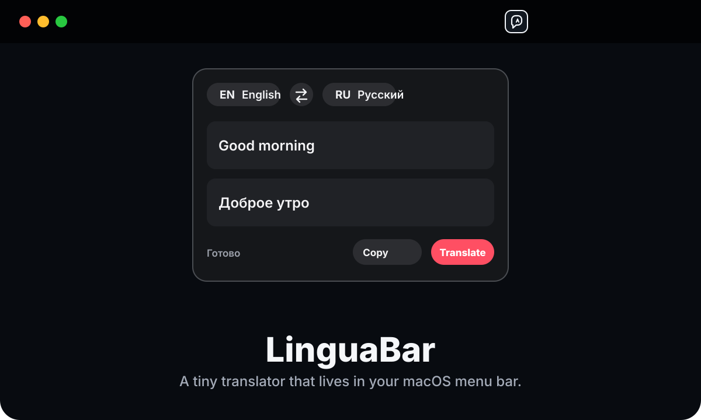
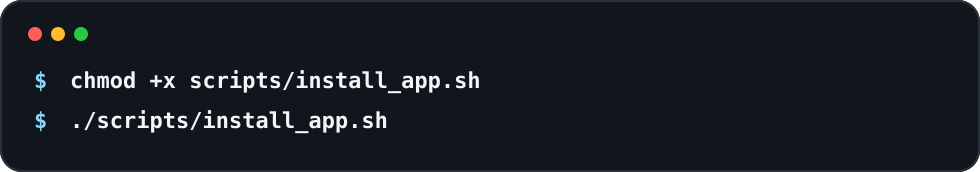
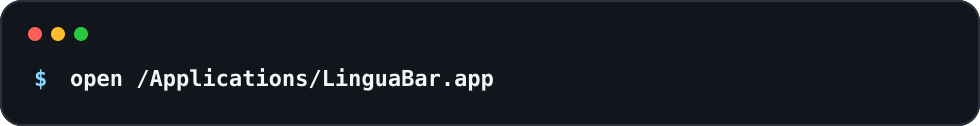
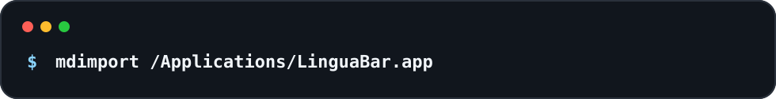
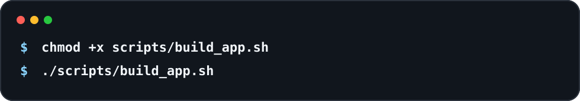
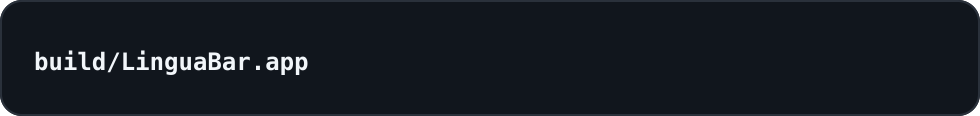
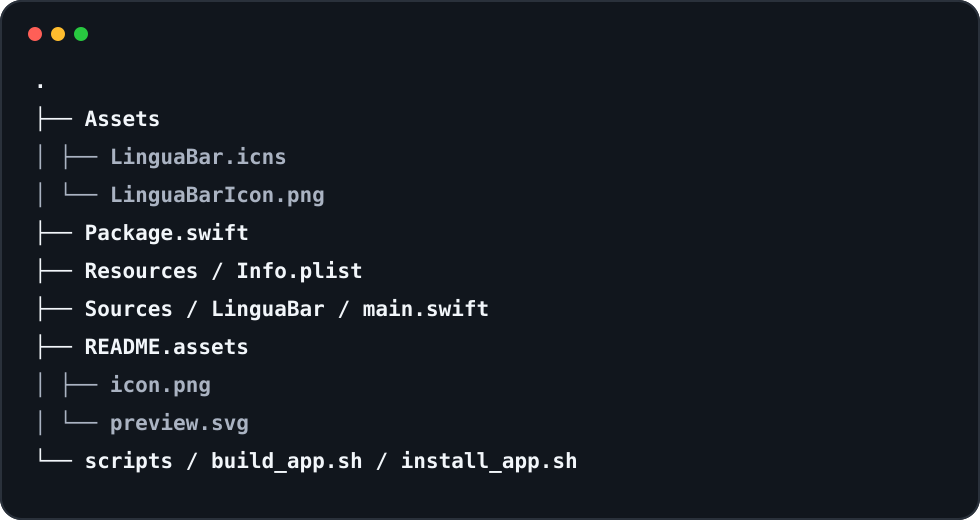

  

<h1 align="center">LinguaBar</h1>

  A tiny, elegant translator that lives in your macOS menu bar.

  
  
  
  

  

## Why LinguaBar

LinguaBar is built for quick translation without opening a browser tab. It stays out of the Dock, sits in the macOS menu bar, and opens as a compact HUD-style panel when you need it.

## Features

- Lives in the macOS menu bar
- Opens and hides with `Command + Option + T`
- Auto-hides when you switch to another app
- Secondary click menu for settings and quit
- Native macOS window controls
- Custom Finder, Spotlight, and menu bar icon
- Compact blur/HUD interface
- Auto-translation while typing
- Language swap and copy action
- Translation between Russian, English, French, Italian, and Spanish
- MyMemory online translation with a small local phrasebook fallback

## Install For Finder And Spotlight

Build, sign, install into `/Applications`, and open LinguaBar:

  

After installation, macOS can open it from:

- Finder: `/Applications/LinguaBar.app`
- Spotlight: search `LinguaBar`
- Terminal:

  

If Spotlight does not show it immediately, wait a minute for indexing or run:

  

## Build Only

  

The app bundle will be created at:

  

## Usage

Press `Command + Option + T` to show or hide the translator window.

Secondary click the menu bar icon to open the menu:

- open or hide the translator
- open settings
- quit LinguaBar completely

## Settings

LinguaBar includes a compact settings panel for:

- showing the translator on launch
- hiding the translator when another app is selected
- automatic translation while typing

## Project Structure

  

## Distribution Note

Local builds are ad-hoc signed. That is enough for personal use, Finder, and Spotlight installation on your own Mac. For public distribution, sign with an Apple Developer ID certificate and notarize the app.

## License

MIT
